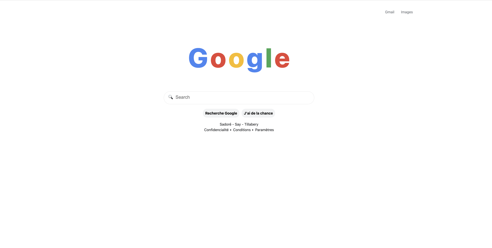
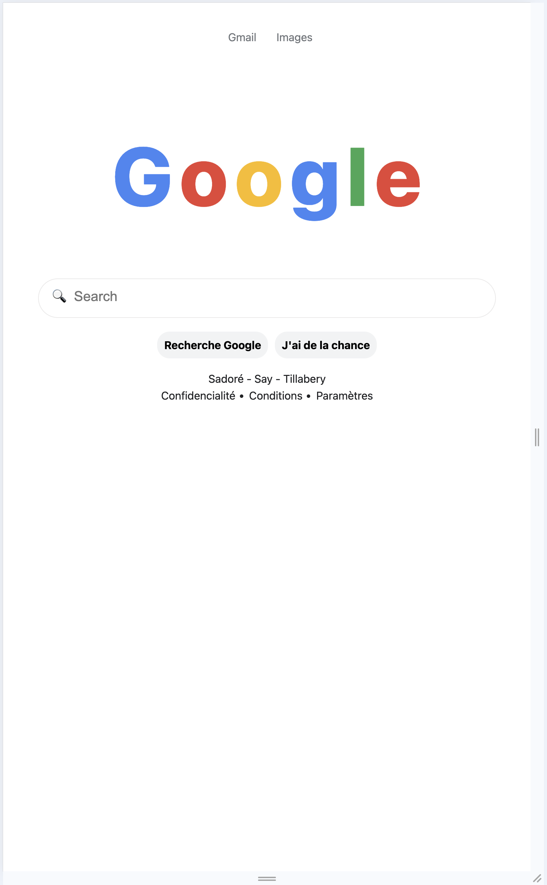

# Description
## Google Home Page
####Ce projet consiste à recréer la page d’accueil de Google en utilisant uniquement les technologies HTML et CSS. L’objectif est de s’exercer à la structuration d’une page web, à l’utilisation des balises sémantiques, à la mise en forme avec CSS et à la reproduction fidèle d’une interface célèbre.

- Structuration de la page avec les balises <header>, <main> et <footer>.
- Affichage du logo Google stylisé avec du texte.
- Création d’une barre de recherche accessible et de boutons d’action.
- Ajout d’un pied de page avec des informations fictives.
- Respect des bonnes pratiques d’accessibilité et de responsive design.
- Ce projet permet de consolider les bases du développement web tout en développant le sens du détail et de la précision dans la reproduction d’interfaces.
---
## Objectifs
- Découvrir la structure de base d’une page HTML
- Utiliser les balises HTML sémantiques
- Appliquer des styles CSS : Lier une feuille de style externe et personnaliser l’apparence de la page.
- Responsive design pour adapter la page aux différents écrans.
- Structurer et organiser son code séparez le contenu (HTML) et la présentation (CSS).
## Fonctionnalités

- Design centré sur le haut de la page
- Responsive (ordinateur, tablette et mobile)
-  interactifs avec effet hover
- Structure HTML sémantique et code CSS organisé
- Flexbox pour une bonne structure

## Technologies utilisées

- HTML5
- CSS3

## Responsivité

- Ordinateur : colonnes empilées verticalement
- Tablette et Mobile : colonnes empilées verticalement
- Textes centrés et image adaptés aux petits écrans
- input de type recherche

## Structure du projet

### Social proof
- index.html
- style.css 
- README.md 

